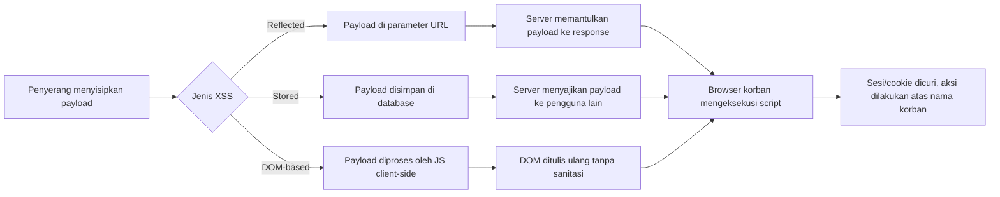
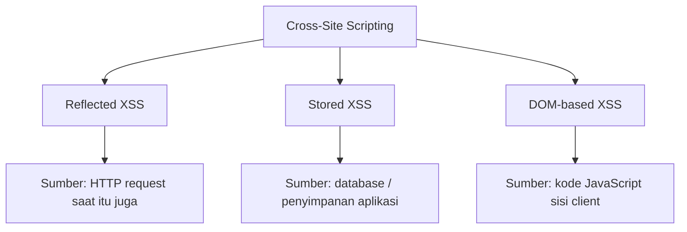

# Cross-Site Scripting (XSS)

## 📖 Overview
Cross-Site Scripting (XSS) adalah salah satu kerentanan web paling umum, di mana penyerang menyisipkan script berbahaya (biasanya JavaScript) ke dalam halaman yang dilihat pengguna lain, sehingga bisa membajak sesi, mencuri data, atau menjalankan aksi atas nama korban. Folder ini berisi catatan belajar dan hasil eksplorasi seputar tiga jenis utama XSS (reflected, stored, DOM-based), konteks-konteks injeksi, teknik eksploitasi, hingga strategi mitigasinya — disusun berdasarkan materi PortSwigger Web Security Academy.

## 🖼️ Gambaran Visual

**Alur serangan XSS secara umum:**

**Tiga jenis XSS berdasarkan sumber payload:**

## 📚 Konsep Utama
Lihat [concepts.md](concepts.md) untuk penjelasan lebih detail. Topik yang dicakup meliputi:

- **Dasar XSS**: definisi, cara kerja, dampak serangan, proof of concept, teknik testing
- **Reflected XSS**: dampak, konteks, testing, FAQ
- **Stored XSS**: dampak, konteks, testing kerentanan
- **DOM-based XSS**: testing (HTML sinks, JavaScript execution sinks, DOM Invader), eksploitasi lewat dependency pihak ketiga (jQuery, AngularJS), kombinasi DOM XSS dengan data reflected/stored, sink-sink umum
- **Konteks XSS**: antar tag HTML, dalam atribut tag HTML, konteks JavaScript (terminasi script, keluar dari string, HTML-encoding, template literals), client-side template injection (AngularJS sandbox & sandbox escape, AngularJS CSP bypass)
- **Eksploitasi XSS**: mencuri cookie, menangkap password, melakukan CSRF
- **Dangling markup injection**: teknik dan pencegahannya
- **Content Security Policy (CSP)**: mitigasi XSS, mitigasi dangling markup, teknik bypass CSP, proteksi clickjacking
- **Pencegahan XSS**: encode data on output, validate input on arrival (whitelist vs blacklist), mengizinkan "safe" HTML, penggunaan template engine, implementasi di PHP/JavaScript/jQuery, penerapan CSP

## 🧪 Labs
Daftar lab dan write-up ada di folder `labs/` (jika tersedia).

## 🛡️ Mitigasi
- Filter dan validasi input saat diterima (whitelist lebih disarankan daripada blacklist)
- Encode data saat dikeluarkan (output), sesuai konteksnya (HTML, atribut, JavaScript, URL, CSS)
- Gunakan template engine yang melakukan auto-escaping secara default
- Terapkan header respons yang tepat (`Content-Type`, `X-Content-Type-Options`) untuk respons non-HTML
- Terapkan Content Security Policy (CSP) sebagai lapisan pertahanan tambahan, dan waspadai teknik bypass-nya
- Berhati-hati saat menggunakan dependency pihak ketiga (jQuery, AngularJS, dll.) yang bisa jadi sumber sink DOM XSS
- Batasi/hindari penggunaan sink berbahaya (`innerHTML`, `eval`, `document.write`, dll.) untuk data yang tidak tepercaya

## 🔗 Referensi
- [PortSwigger Web Security Academy — Cross-site scripting](https://portswigger.net/web-security/cross-site-scripting)
