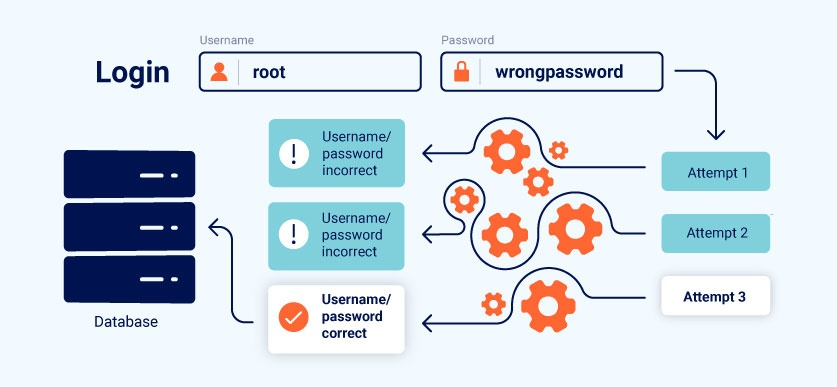

# Business Logic Vulnerabilities

## 📖 Overview
Business logic vulnerabilities adalah celah keamanan yang muncul dari kesalahan desain alur/aturan aplikasi, bukan dari bug teknis seperti injection atau XSS. Celah ini memungkinkan penyerang memanipulasi fungsionalitas yang sah untuk mencapai tujuan yang tidak diinginkan oleh developer — misalnya melewati validasi, membuat asumsi yang salah dieksploitasi, atau menyalahgunakan alur multi-step.

Contoh sederhana ditunjukkan pada diagram di bawah: sebuah form login yang tidak membatasi jumlah percobaan (no rate limiting / no account lockout). Selama tidak ada mekanisme pembatasan di sisi server, penyerang bebas mencoba banyak kombinasi password secara berulang sampai berhasil — sebuah logic flaw klasik pada mekanisme autentikasi.

## 📚 Konsep Utama
Lihat [concepts.md](concepts.md) untuk penjelasan lebih detail mengenai definisi, penyebab, dampak, dan contoh skenario business logic vulnerabilities.

## 🧪 Labs
Daftar lab dan write-up ada di folder `labs/` (jika tersedia).

## 🛡️ Mitigasi
- Terapkan rate limiting dan account lockout/backoff pada endpoint login untuk mencegah percobaan password tanpa batas (seperti pada ilustrasi di atas).
- Validasi ulang semua input dan aturan alur di sisi server — jangan mengandalkan validasi client-side.
- Jangan berasumsi pengguna akan selalu mengikuti urutan langkah yang "diharapkan"; verifikasi status setiap step di server sebelum mengizinkan step berikutnya.
- Terapkan CAPTCHA atau multi-factor authentication sebagai lapisan tambahan setelah beberapa kali percobaan gagal.
- Dokumentasikan asumsi desain pada setiap alur kritikal (login, checkout, reset password) agar mudah diaudit tim lain.

## 🔗 Referensi
- PortSwigger Web Security Academy — Business Logic Vulnerabilities
